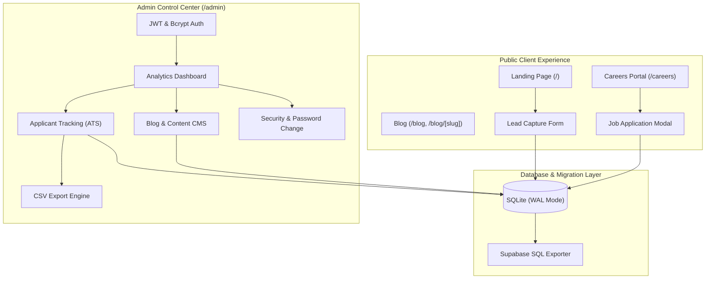

# 🚀 DEVops — Software Engineering & Cloud Agency Platform

[](https://nextjs.org/)
[](https://www.typescriptlang.org/)
[](https://tailwindcss.com/)
[](https://www.sqlite.org/)
[](#license)

A modern, production-ready, full-stack digital agency web platform built with **Next.js 14 App Router**, **TypeScript**, **Tailwind CSS**, and **SQLite**. Features a high-converting public agency website, a dynamic CMS blog, a public **Careers Portal & Applicant Tracking System (ATS)**, and a secure, comprehensive **Admin Control Center**.

---

## 🌟 Platform Overview



---

## ✨ Key Features

### 1. 🌐 High-Converting Public Agency Experience (`/`)
- **Modern Hero Section**: High-impact value proposition with interactive CTA buttons.
- **Dynamic Services Showcase**: Displays engineering specialties, feature checklists, and technology tags fetched directly from SQLite.
- **Enterprise Tech Stack**: Interactive grid showing frontend, backend, cloud, and DevOps tooling.
- **Why Us & Delivery Process**: Structured 4-phase agile engineering workflow from Discovery to Scaling.
- **Portfolio & Case Studies**: Project cards with category filters, live links, and GitHub links.
- **Agency Metrics & Testimonials**: Client endorsements with star ratings and real-time metric counters.
- **Lead Capture Contact Form**: Validated contact form that saves client inquiries into SQLite with status tracking.

### 2. 💼 Careers Portal & Applicant Tracking System (`/careers` & `/admin/careers`)
- **Public Careers Page (`/careers`)**:
  - Highlights agency culture and perks (Remote-First, Hardware Stipends, Learning Budgets).
  - Department filter pills (**All**, **Engineering**, **Cloud & DevOps**, **Design**, **Mobile**).
  - Expandable job listings with detailed requirements and responsibilities.
  - Interactive **"Apply Now"** modal with validation for contact info, resume/portfolio links, and cover letter.
- **Admin ATS Dashboard (`/admin/careers`)**:
  - **Candidate Pipeline**: Manage applicants across stages: `New` ➔ `Reviewed` ➔ `Interviewing` ➔ `Hired` / `Rejected`.
  - **Applicant Review**: View candidate profiles, cover letters, and external portfolio/LinkedIn links.
  - **Job Postings CRUD**: Create, edit, toggle active status, and remove job openings.
  - **CSV Export**: One-click export of all job applications (`devops-applications-YYYY-MM-DD.csv`).

### 3. 📰 Dynamic Blog & Content CMS (`/blog` & `/admin/blog`)
- **Public Blog (`/blog` & `/blog/[slug]`)**:
  - Responsive article grid displaying reading times, publication dates, and excerpts.
  - Rich reading layout with back navigation and clean typography.
  - Dynamic OpenGraph and Twitter card metadata for rich social sharing.
- **Admin Blog CMS (`/admin/blog`)**:
  - Create, edit, and delete articles with auto-slug generation.
  - One-click publish / unpublish toggling.

### 4. 🛡️ Admin Management Suite (`/admin/*`)
- **JWT & Secure Cookie Auth**:
  - Authenticated via HTTP-only, SameSite cookies with timing-attack resistant password verification.
  - Adaptive protocol detection ensures seamless sessions across local development (`http://`) and production deployments (`https://`).
- **Administrative Modules**:
  - **Dashboard**: High-level KPI metrics (services, portfolio, blog count, open jobs, leads, and candidate pipeline).
  - **Services Management**: Create, edit, reorder, and remove services.
  - **Portfolio Management**: Manage client case studies and project tags.
  - **Testimonials Management**: Manage verified customer quotes and ratings.
  - **Contacts & Enquiries**: Review leads, update statuses (`New`, `In Progress`, `Contacted`, `Archived`), and **Export to CSV**.
  - **Account Settings & Security (`/admin/settings`)**: Update login email and change password with bcrypt current-password validation.

### 5. 🔍 SEO & Production Readiness
- **Dynamic Sitemap (`/sitemap.xml`)**: Automatically queries published blog articles and site routes.
- **Robots Directives (`/robots.txt`)**: Allows search engine indexing of public routes while shielding `/admin/*` and `/api/*`.
- **Cloud Migration Ready**: Includes a dedicated script (`npm run export:supabase`) to export the local SQLite database into PostgreSQL/Supabase compatible SQL format (`data/supabase-migration.sql`).

---

## 🛠️ Tech Stack

| Layer | Technology |
|---|---|
| **Framework** | [Next.js 14](https://nextjs.org/) (App Router, Server & Client Components) |
| **Language** | [TypeScript](https://www.typescriptlang.org/) (Strict Mode) |
| **Styling** | [Tailwind CSS](https://tailwindcss.com/) with custom DEVops blue palette (`#0B63E5`) |
| **Icons** | [Lucide React](https://lucide.dev/) |
| **Database** | [better-sqlite3](https://github.com/WiseLibs/better-sqlite3) (SQLite in WAL mode, busy timeout 5000ms) |
| **Authentication** | [Jose](https://github.com/panva/jose) (JWT), [BcryptJS](https://github.com/dcodeIO/bcrypt.js) |
| **Script Runner** | [tsx](https://github.com/privatenumber/tsx) |

---

## 📁 Project Structure

```
├── data/
│   ├── devops.db                 # SQLite database file (auto-created, gitignored)
│   └── supabase-migration.sql    # Generated PostgreSQL/Supabase migration
├── scripts/
│   ├── seed.ts                   # Initial database seeder (admin, services, jobs, etc.)
│   ├── export-supabase-sql.ts    # SQLite to PostgreSQL/Supabase exporter
│   └── verify-careers.js         # Automated end-to-end verification script
├── src/
│   ├── app/
│   │   ├── admin/                # Admin portal pages
│   │   │   ├── blog/             # Blog CMS management
│   │   │   ├── careers/          # Applicant Tracking System (ATS) & Job Postings
│   │   │   ├── contacts/         # Lead inquiries & CSV export
│   │   │   ├── dashboard/        # Analytics dashboard
│   │   │   ├── portfolio/        # Project showcase management
│   │   │   ├── services/         # Services CRUD
│   │   │   ├── settings/         # Admin account settings & password change
│   │   │   ├── stats/            # Agency statistics management
│   │   │   ├── team/             # Team members management
│   │   │   ├── testimonials/     # Testimonials management
│   │   │   ├── layout.tsx        # Protected admin layout & sidebar
│   │   │   └── login/            # Admin sign-in screen
│   │   ├── api/                  # REST API endpoints
│   │   │   ├── admin/            # Authenticated admin CRUD routes
│   │   │   ├── auth/             # Login, logout, me routes
│   │   │   ├── blog/             # Blog routes
│   │   │   ├── careers/          # Job listings & application submission
│   │   │   └── contacts/         # Public lead capture
│   │   ├── blog/                 # Public blog pages
│   │   │   ├── [slug]/           # Dynamic post reading view
│   │   │   └── page.tsx          # Blog catalog
│   │   ├── careers/              # Public careers & recruitment portal
│   │   ├── layout.tsx            # Root layout with OpenGraph metadata
│   │   ├── page.tsx              # Agency landing page (Server Component)
│   │   ├── robots.ts             # Search engine crawling rules
│   │   └── sitemap.ts            # Dynamic sitemap generator
│   ├── components/
│   │   └── devops/               # Modular landing page & navigation components
│   ├── data/
│   │   └── devopsData.ts         # Fallback data & agency constants
│   ├── lib/
│   │   ├── auth.ts               # JWT signing, verification, and cookie helpers
│   │   ├── db.ts                 # SQLite connection singleton & schema initialization
│   │   └── utils.ts              # Styling and formatting utility functions
│   └── types/                    # TypeScript interfaces
├── .env.example                  # Environment variable template
└── package.json
```

---

## 🚀 Quick Start Guide

### 1. Prerequisites
- **Node.js**: v18.17+ or v20+ recommended
- **npm** or **pnpm** / **yarn**

### 2. Installation
Clone the repository and install dependencies:
```bash
git clone https://github.com/shinchan2222/LEARNING_PLATFORM.git
cd LEARNING_PLATFORM
npm install
```

### 3. Environment Configuration
Copy the environment template:
```bash
cp .env.example .env
```
*(Optional)* Set a custom `JWT_SECRET` in `.env`:
```env
JWT_SECRET=your-super-secret-jwt-key-here
```

### 4. Database Setup & Seeding
Initialize the SQLite database with default admin credentials, agency services, starter blog posts, and 4 job openings:
```bash
npm run seed
```

### 5. Running in Development
Start the local development server:
```bash
npm run dev
```
Open [http://localhost:3000](http://localhost:3000) in your browser.

### 6. Production Build & Start
To test the production build locally:
```bash
npm run build
npm run start
```

---

## 🔑 Default Admin Credentials

Access the Admin Control Center at **[http://localhost:3000/admin/login](http://localhost:3000/admin/login)**:

| Field | Default Value |
|---|---|
| **Email** | `admin@devops.com` |
| **Password** | `admin123` |

> 🔒 **Security Notice**: Remember to update your email and password via **Admin ➔ Settings** (`/admin/settings`) prior to deploying into a live production environment.

---

## 📜 Available NPM Scripts

| Command | Description |
|---|---|
| `npm run dev` | Starts the Next.js development server with Turbopack/HMR |
| `npm run build` | Compiles TypeScript, collects page data, and generates optimized static & dynamic routes |
| `npm run start` | Runs the compiled Next.js production build |
| `npm run seed` | Initializes SQLite schema and seeds demo content and default admin user |
| `npm run export:supabase` | Generates `data/supabase-migration.sql` with full PostgreSQL schema and data inserts |
| `npm run lint` | Runs ESLint validation across the codebase |

---

## ☁️ Supabase / PostgreSQL Migration

If you plan to deploy on cloud platforms (e.g., Vercel, Supabase, AWS RDS), you can export your local SQLite data into PostgreSQL with one command:

```bash
npm run export:supabase
```

This generates `data/supabase-migration.sql` containing:
- Complete PostgreSQL DDL with appropriate types (`TIMESTAMPTZ`, `JSONB`, `SERIAL`).
- Parametrized `INSERT` statements for all existing database records.
- Sequence reset queries (`setval()`) to avoid primary key ID collisions.

You can paste the generated SQL script directly into the **Supabase SQL Editor**.

---

## 📄 License

This project is licensed under the **MIT License**.
